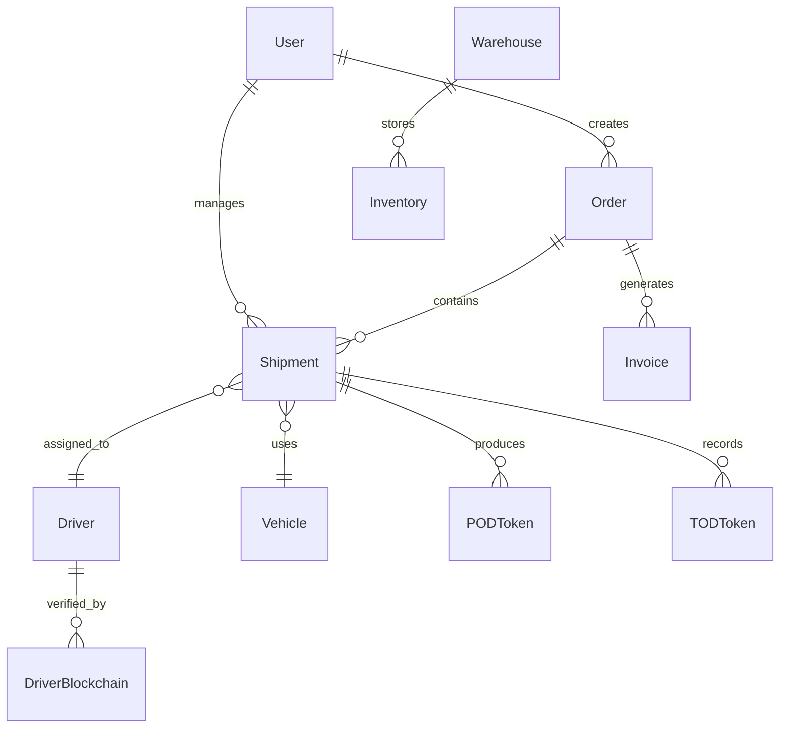

<p align="center">
  
  
  
  
  
  
</p>

<h1 align="center">🚚 Bharat Logistics ERP</h1>

<p align="center">
  <strong>Enterprise-Grade Logistics Management Platform with Blockchain Verification & AI-Powered Analytics</strong>
</p>

<p align="center">
  <a href="#-features">Features</a> •
  <a href="#-architecture">Architecture</a> •
  <a href="#-tech-stack">Tech Stack</a> •
  <a href="#-getting-started">Getting Started</a> •
  <a href="#-api-reference">API</a> •
  <a href="#-deployment">Deployment</a>
</p>

---

## 📋 Overview

**Bharat Logistics ERP** is a comprehensive, production-ready logistics management solution that combines the reliability of traditional web technologies with the innovation of blockchain verification and artificial intelligence. The platform provides complete tools for managing every aspect of logistics operations—from order management to delivery confirmation—with immutable proof stored on the Polygon blockchain.

### 🎯 Key Highlights

- **🔗 Blockchain-Verified Documents**: Immutable proof of delivery (POD), transfer of delivery (TOD), and Vahak records on Polygon Amoy
- **🤖 8 AI-Powered Agents**: Intelligent assistance powered by Google Gemini 2.0 for fleet optimization, inventory analysis, and more
- **📊 Real-Time Dashboard**: Live tracking, instant notifications, and comprehensive analytics via Socket.io
- **🔐 Enterprise Security**: JWT authentication, rate limiting, Helmet.js protection, and role-based access control
- **☁️ Cloud-Ready**: Configured for Vercel (frontend) and Render (backend) deployments

---

## ✨ Features

### 🚛 Core Logistics Management

| Module | Description |
|--------|-------------|
| **Order Management** | Complete order lifecycle from creation to delivery confirmation |
| **Shipment Tracking** | Real-time GPS tracking with live status updates |
| **Fleet Management** | Vehicle and driver administration with assignment optimization |
| **Inventory Control** | Multi-warehouse stock management with reorder alerts |
| **Warehouse Operations** | Facility management with capacity tracking |
| **Invoice & Billing** | Automated invoicing and payment tracking |

### 🔗 Blockchain Integration

```
┌─────────────────────────────────────────────────────────────┐
│                    HYBRID ARCHITECTURE                       │
├─────────────────────────────────────────────────────────────┤
│  📦 Off-Chain (MongoDB)     │  ⛓️ On-Chain (Polygon Amoy)   │
│  ──────────────────────────  │  ─────────────────────────── │
│  • Fast CRUD operations      │  • POD Token verification    │
│  • User data & sessions      │  • TOD Token verification    │
│  • Real-time updates         │  • Vahak Record anchoring    │
│  • Analytics & reporting     │  • Immutable audit trail     │
└─────────────────────────────────────────────────────────────┘
```

**Smart Contract: `LogisticsTracker.sol`**
- Stores SHA-256 hashes of logistics documents on-chain
- Provides tamper detection via `checkIntegrity()` function
- Emits `RecordVerified` events for audit trails
- Supports POD, TOD, and VAHAK record types

### 🤖 AI Agent System

8 specialized AI agents powered by **Google Gemini 2.0**:

| Agent | Capabilities |
|-------|-------------|
| **Fleet Optimizer** | Route optimization, vehicle assignments, driver scheduling |
| **Inventory Analyst** | Stock predictions, reorder recommendations, warehouse distribution |
| **Shipment Tracker** | Delivery predictions, delay alerts, ETA calculations |
| **Contract Intelligence** | PDF analysis, term extraction, contract summarization |
| **Zone Analytics** | Heatmap visualization, zone pricing optimization |
| **Cost Analytics** | Spending analysis, budget predictions, cost optimization |
| **Market Intelligence** | Real-time stock data via Yahoo Finance, industry news aggregation |
| **Support Assistant** | Platform guidance, FAQ responses, best practices |

### 📊 Real-Time Features

- **WebSocket Integration**: Instant notifications via Socket.io
- **Room-Based Architecture**: Personal, role-based, and shipment-specific channels
- **Live Tracking**: Real-time vehicle and shipment status updates
- **Push Notifications**: Instant alerts for POD generation, status changes, inventory alerts

---

## 🏗️ Architecture

```
logistics_project/
├── 📁 backend/              # Express.js API Server
│   ├── src/
│   │   ├── config/          # Database & environment configuration
│   │   ├── middleware/      # Auth, validation, error handling
│   │   ├── models/          # 14 MongoDB schemas
│   │   ├── routes/          # 17 API route modules
│   │   ├── services/        # Blockchain, notifications, smart contracts
│   │   ├── utils/           # Cryptographic utilities
│   │   └── seeders/         # Database population scripts
│   └── Dockerfile           # Container deployment
│
├── 📁 frontend/             # Next.js 16 Application
│   ├── src/
│   │   ├── app/            # App Router pages
│   │   │   ├── dashboard/  # 12 dashboard modules
│   │   │   └── login/      # Authentication pages
│   │   ├── components/     # Reusable UI components
│   │   ├── context/        # React context providers
│   │   └── lib/            # Utility libraries
│   └── public/             # Static assets
│
├── 📁 smart_contracts/      # Hardhat Project
│   ├── contracts/          # Solidity contracts
│   ├── scripts/            # Deployment scripts
│   └── hardhat.config.js   # Network configuration
│
└── 📄 render.yaml           # Infrastructure-as-code
```

### Database Schema



---

## 🛠️ Tech Stack

### Backend
| Technology | Version | Purpose |
|------------|---------|---------|
| Node.js | 18+ | Runtime environment |
| Express.js | 4.18.x | Web framework |
| MongoDB | 7.0+ | Primary database |
| Mongoose | 8.x | ODM library |
| Socket.io | 4.x | Real-time communication |
| Ethers.js | 6.x | Blockchain interaction |
| Google Generative AI | 0.24.x | AI agent system |
| Yahoo Finance | 3.x | Market data |

### Frontend
| Technology | Version | Purpose |
|------------|---------|---------|
| Next.js | 16.1.2 | React framework |
| React | 19.2.3 | UI library |
| TypeScript | 5.x | Type safety |
| Chart.js | 4.x | Data visualization |
| Socket.io-client | 4.x | Real-time updates |
| React Icons | 5.x | Icon library |

### Blockchain
| Technology | Version | Purpose |
|------------|---------|---------|
| Hardhat | 2.19.x | Development environment |
| Solidity | 0.8.19 | Smart contract language |
| Polygon Amoy | Testnet | Blockchain network |

---

## 🚀 Getting Started

### Prerequisites

- **Node.js** 18.x or higher
- **MongoDB** 7.0+ (local or Atlas)
- **Git**
- **MetaMask** wallet (for blockchain features)

### Installation

1. **Clone the repository**
   ```bash
   git clone https://github.com/your-username/bharat-logistics-erp.git
   cd bharat-logistics-erp
   ```

2. **Backend Setup**
   ```bash
   cd backend
   npm install
   
   # Create environment file
   cp .env.example .env
   ```
   
   Configure `.env`:
   ```env
   MONGODB_URI=mongodb://localhost:27017/logistics_erp
   JWT_SECRET=your-secret-key
   GEMINI_API_KEY=your-gemini-api-key
   POLYGON_RPC_URL=https://rpc-amoy.polygon.technology
   PRIVATE_KEY=your-wallet-private-key
   CONTRACT_ADDRESS=your-deployed-contract-address
   ```

3. **Frontend Setup**
   ```bash
   cd frontend
   npm install
   
   # Create environment file
   echo "NEXT_PUBLIC_API_URL=http://localhost:5000" > .env.local
   ```

4. **Smart Contracts Setup** (Optional)
   ```bash
   cd smart_contracts
   npm install
   
   # For local development
   npx hardhat node  # Start local blockchain
   npm run deploy:local
   
   # For Polygon Amoy testnet
   npm run deploy:amoy
   ```

### Running the Application

**Start Backend:**
```bash
cd backend
npm run dev    # Development with hot reload
# or
npm start      # Production mode
```

**Start Frontend:**
```bash
cd frontend
npm run dev
```

**Access the application:**
- Frontend: `http://localhost:3000`
- Backend API: `http://localhost:5000`

### Database Seeding

Populate the database with sample data:
```bash
cd backend
npm run seed
```

---

## 📡 API Reference

### Authentication
| Method | Endpoint | Description |
|--------|----------|-------------|
| POST | `/api/auth/register` | Register new user |
| POST | `/api/auth/login` | User login |
| GET | `/api/auth/me` | Get current user |

### Core Operations
| Method | Endpoint | Description |
|--------|----------|-------------|
| GET/POST | `/api/orders` | Order management |
| GET/POST | `/api/shipments` | Shipment tracking |
| GET/POST | `/api/warehouses` | Warehouse operations |
| GET/POST | `/api/inventory` | Inventory control |
| GET/POST | `/api/fleet` | Fleet management |
| GET/POST | `/api/invoices` | Invoice processing |

### Advanced Features
| Method | Endpoint | Description |
|--------|----------|-------------|
| POST | `/api/ai/*` | AI agent endpoints |
| GET/POST | `/api/blockchain` | On-chain verification |
| GET/POST | `/api/pod` | Proof of Delivery tokens |
| GET/POST | `/api/tod` | Transfer of Delivery tokens |
| GET | `/api/dashboard` | Dashboard statistics |
| GET | `/api/reports` | Report generation |

---

## ☁️ Deployment

### Frontend (Vercel)

1. Connect your GitHub repository to Vercel
2. Set environment variables:
   ```
   NEXT_PUBLIC_API_URL=https://alexiy05-logistics-backend.hf.space/api
   ```
3. Deploy

### Backend (Render)

The project includes a `render.yaml` for easy deployment:

1. Connect your GitHub repository to Render
2. Set environment variables in Render dashboard
3. Deploy using the Blueprint

### Smart Contracts (Polygon Amoy)

```bash
cd smart_contracts
npm run deploy:amoy
```

See [DEPLOYMENT_GUIDE.md](smart_contracts/DEPLOYMENT_GUIDE.md) for detailed instructions.

---

## 🔐 Security

- **Authentication**: JWT-based with secure signing
- **Password Hashing**: bcryptjs with salt rounds
- **Rate Limiting**: 100 requests per 15 minutes per IP
- **HTTP Security**: Helmet.js middleware
- **CORS**: Configured for approved origins only
- **Input Validation**: express-validator on all endpoints
- **Blockchain**: Immutable audit trail for critical operations

---

## 🤝 Contributing

Contributions are welcome! Please follow these steps:

1. Fork the repository
2. Create a feature branch (`git checkout -b feature/amazing-feature`)
3. Commit your changes (`git commit -m 'Add amazing feature'`)
4. Push to the branch (`git push origin feature/amazing-feature`)
5. Open a Pull Request

---

## 📄 License

This project is licensed under the MIT License - see the [LICENSE](LICENSE) file for details.

---

## 👥 Authors

- **Bharat Logistics Team** - *Initial development*

---

<p align="center">
  <strong>Built with ❤️ for the future of logistics</strong>
</p>

<p align="center">
  <a href="#-bharat-logistics-erp">Back to Top ↑</a>
</p>
